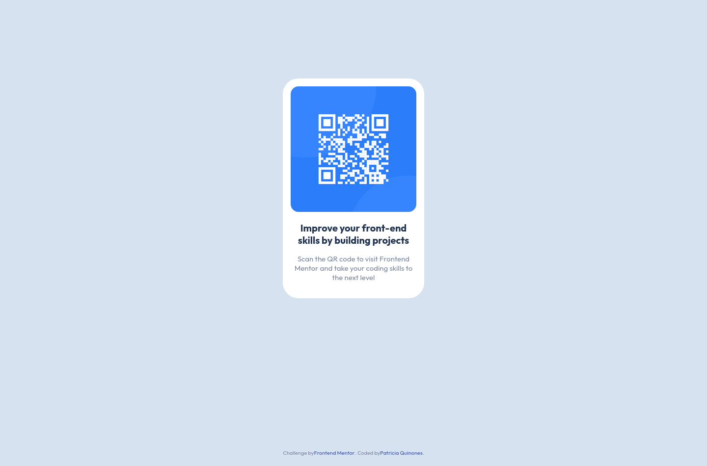
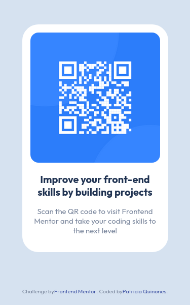

# Frontend Mentor - QR code component solution

This is a solution to the [QR code component challenge on Frontend Mentor](https://www.frontendmentor.io/challenges/qr-code-component-iux_sIO_H). Frontend Mentor challenges help you improve your coding skills by building realistic projects. 

## Table of contents

- [Overview](#overview)
  - [Screenshot](#screenshot)
  - [Links](#links)
- [My process](#my-process)
  - [Built with](#built-with)
- [Author](#author)

**Note: Delete this note and update the table of contents based on what sections you keep.**

## Overview

### Screenshot

### Links

- Solution URL: (https://github.com/patriciaquinones/qr-code-component-main.git)
- Live Site URL: (https://qr-component0.netlify.app/)

### Built with

- Semantic HTML5 markup
- CSS custom properties
- Flexbox
- Mobile-first workflow

## Author

- Frontend Mentor - [@patriciaquinones](https://www.frontendmentor.io/profile/patriciaquinones)
- Twitter - [@PatriciaQBaut](https://twitter.com/patriciaqbaut)
- Github -(https://github.com/patriciaquinones)

